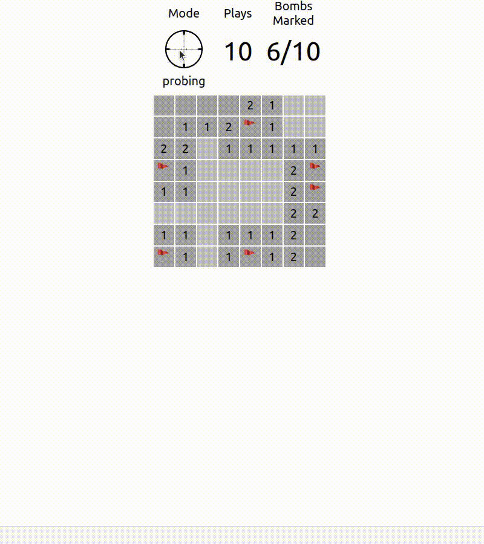
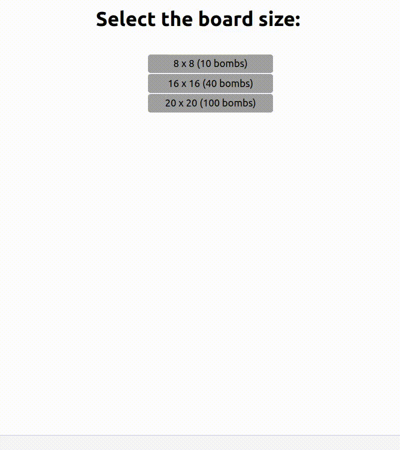

# React Minesweeper

[Play Now!](https://edcampossouza.github.io/react-minesweeper/)

# Gameplay

Click on the Mode icon to switch between the "marking" and "probing" modes

## Marking Mode

Click on a cell to mark it as a bomb. Win the game by marking all the bombs!

## Probing Mode

Click on a cell to probe it.

If the cell is safe, you will se the number of bombs adjacent to it.
But if the cell is a bomb, you lose!

